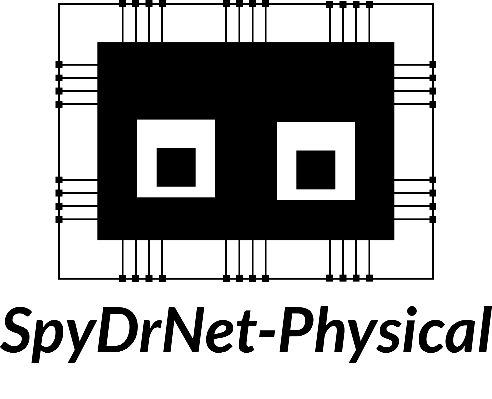

.. TODO: Add readme here and small snippets hoe to use
.. .. include:: ../../README.rst

.. .. only:: html

..     :Release: |version|
..     :Date: |today|

SpyDrNet-Physical Documentation
-------------------------------

.. toctree::
   :maxdepth: 1

   install
   reference/index
   auto_sample_verilog/index
   example.rst

Indices and tables
------------------

* :ref:`genindex`
* :ref:`modindex`
* :ref:`search`
